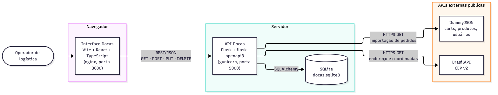

# Docas — Interface

**Docas** é um serviço de expedição e cotação de frete para lojas online. Esta é a interface web do operador de logística. Nela ele busca os pedidos da loja, cota o frete em três modalidades, contrata a melhor opção e acompanha cada pedido até a entrega.

Este repositório é a **componente principal** do MVP da disciplina de Arquitetura de Software da pós-graduação em Engenharia de Software da PUC-Rio. A API REST fica em [mvp-pucrio-arquitetura-docas-api](https://github.com/eduardobbrito/mvp-pucrio-arquitetura-docas-api).

Stack: Vite, React 18, TypeScript, React Router, TanStack Query, Tailwind CSS, shadcn/ui (Radix), recharts (gráfico do painel, via componente Chart do shadcn), sonner (toasts) e lucide-react (ícones). Em produção, o build estático é servido por nginx.

## Como rodar a API e a interface

Clone os dois repositórios lado a lado na mesma pasta:

```bash
git clone https://github.com/eduardobbrito/mvp-pucrio-arquitetura-docas-api.git
git clone https://github.com/eduardobbrito/mvp-pucrio-arquitetura-docas-front.git
```

### Opção 1 — docker-compose (as duas componentes de uma vez)

O `docker-compose.yml` fica na raiz do repositório da interface (componente principal):

```bash
cd mvp-pucrio-arquitetura-docas-front
docker compose up --build
```

### Opção 2 — Docker, um container por componente

Terminal 1 (API):

```bash
cd mvp-pucrio-arquitetura-docas-api
docker build -t docas-api .
docker run -p 5000:5000 docas-api
```

Terminal 2 (interface):

```bash
cd mvp-pucrio-arquitetura-docas-front
docker build --build-arg VITE_API_URL=http://localhost:5000 -t docas-front .
docker run -p 3000:80 docas-front
```

### Opção 3 — local, sem Docker (Python 3.12 e Node 20.19+)

Terminal 1 (API):

```bash
cd mvp-pucrio-arquitetura-docas-api
python3.12 -m venv .venv
source .venv/bin/activate
pip install -r requirements.txt
python app.py
```

Terminal 2 (interface):

```bash
cd mvp-pucrio-arquitetura-docas-front
npm install
cp .env.example .env
npm run dev
```

| | Docker (opções 1 e 2) | Local (opção 3) |
|---|---|---|
| Interface | http://localhost:3000 | http://localhost:5173 |
| API / Swagger | http://localhost:5000/openapi | http://localhost:5000/openapi |

## Páginas e funcionalidades

| Rota | Página | O que faz |
|---|---|---|
| `/` | Fila de pedidos | Tabela com pedido, cliente, destino e distância, itens, peso cobrado, entrega prometida e status. Filtros por status e UF, busca por cliente, cidade ou número do pedido (com debounce) e paginação, todos guardados na URL: o link da fila filtrada pode ser compartilhado. O botão **"Buscar novos pedidos"** importa um lote da loja. Pedidos atrasados ganham o selo **Atrasado** e a linha fica destacada. |
| `/pedidos/:id` | Detalhe do pedido | Cliente e endereço, com aviso quando a BrasilAPI não confirmou o endereço. Mostra peso real, cubado e cobrado, distância e itens. **Cotar frete** gera um cartão por modalidade: selecione um e clique em **Contratar**. **Marcar em trânsito** e **Marcar entregue** avançam o status. **Cancelar pedido** pede confirmação em um diálogo. A linha do tempo mostra os cinco status e o histórico de movimentações. |
| `/tarifas` | Tarifas | Tabela de frete por faixa de peso e distância, com criação, edição e remoção em diálogos, e a lista de modalidades (econômico, padrão, expresso) com os ajustes de valor e prazo. Um aviso lembra que os valores são ilustrativos e configuráveis. |
| `/painel` | Painel | Cartões com pedidos aguardando cotação, em trânsito, atrasados e frete médio (com o prazo médio contratado), gráfico de barras do frete médio por região e contagem de pedidos por status. |

Cada ação mostra um toast de sucesso ou a mensagem de erro vinda da API. As listas têm estados de carregamento, erro e vazio. Os status têm cores fixas: recebido em neutro, cotado em alerta, contratado e em trânsito em destaque, entregue em sucesso, cancelado e atrasado em erro. As telas se adaptam a larguras a partir de 360 px: no celular, colunas secundárias das tabelas saem de cena e as informações essenciais continuam visíveis.

## Arquitetura



A interface roda no navegador e **fala somente com a API Docas**, por REST/JSON. Ela **nunca chama as APIs externas** (DummyJSON e BrasilAPI) diretamente: quem as consome é a API, que também guarda os dados em SQLite. A fonte do diagrama está em [`docs/arquitetura.mmd`](docs/arquitetura.mmd), a mesma usada no repositório da API.

Organização do código:

```
src/
  api/          cliente HTTP (cliente.ts), tipos gerados do Swagger e hooks TanStack Query
  paginas/      FilaPedidos, DetalhePedido, Tarifas, Painel
  componentes/
    layout/     LayoutApp, Navegacao
    pedidos/    SeloStatus, FiltrosFila, CartaoCotacao, LinhaDoTempo, TabelaItens, BotaoCancelarPedido
    tarifas/    DialogoTarifa, BotaoRemoverTarifa, TabelaModalidades
    painel/     CartaoMetrica, GraficoFreteRegiao
    comuns/     EstadoVazio, Carregando, Paginacao
    ui/         componentes gerados pelo shadcn
  lib/          formatadores (moeda, data, peso), regras de status, lista de UFs, utils do shadcn
```

## APIs externas do sistema

Estas APIs são consumidas **pela API Docas**, não pela interface. Estão listadas aqui porque sustentam os dados exibidos na tela.

| API | URL | Licença | Cadastro/chave | Rotas usadas (pela API) |
|---|---|---|---|---|
| DummyJSON | https://dummyjson.com | Gratuita, de uso público (projeto open source) | Não exige | `GET /carts`, `GET /products/{id}`, `GET /users/{id}` |
| BrasilAPI | https://brasilapi.com.br | MIT | Não exige | `GET /api/cep/v2/{cep}` |

A DummyJSON simula a loja: cada *cart* vira um pedido, e os produtos trazem peso (kg) e dimensões (cm). A BrasilAPI confirma o endereço brasileiro atribuído a cada pedido e fornece as coordenadas usadas no cálculo da distância.

## Rotas da API consumidas

| Método | Rota | Onde é usada |
|---|---|---|
| GET | `/pedidos?status=&uf=&q=&pagina=&por_pagina=` | Fila de pedidos (filtros, busca e paginação) |
| GET | `/pedidos/{id}` | Detalhe do pedido |
| POST | `/pedidos/importar` | Botão "Buscar novos pedidos" |
| POST | `/pedidos/{id}/cotacoes` | Botão "Cotar frete" / "Cotar novamente" |
| PUT | `/cotacoes/{id}/contratar` | Botão "Contratar" |
| PUT | `/pedidos/{id}/status` | Botões "Marcar em trânsito" e "Marcar entregue" |
| DELETE | `/pedidos/{id}` | Botão "Cancelar pedido" |
| GET | `/tarifas` | Tabela de tarifas |
| POST | `/tarifas` | Botão "Nova tarifa" |
| PUT | `/tarifas/{id}` | Botão de editar tarifa |
| DELETE | `/tarifas/{id}` | Botão de remover tarifa |
| GET | `/modalidades` | Aba "Modalidades" da tela de tarifas |
| GET | `/painel` | Painel |

Os tipos TypeScript (`src/api/esquemaOpenapi.ts`) são gerados do Swagger da API. Com a API rodando em `http://localhost:5000`, regenere-os com:

```bash
npm run gerar:tipos
```

## Execução local

Requer Node 20.19 ou superior e a API Docas rodando (veja o README da API).

```bash
npm install
cp .env.example .env   # VITE_API_URL=http://localhost:5000
npm run dev
```

A interface abre em http://localhost:5173. A API já libera essa origem e a porta 3000 no CORS.

## Execução com Docker

A URL da API é embutida no build, por isso ela é passada como `--build-arg`:

```bash
docker build --build-arg VITE_API_URL=http://localhost:5000 -t docas-front .
docker run -p 3000:80 docas-front
```

A interface fica em **http://localhost:3000**. Para subir a API em Docker, veja o [README da API](https://github.com/eduardobbrito/mvp-pucrio-arquitetura-docas-api#execução-com-docker).

## Execução com docker-compose (API + interface)

O `docker-compose.yml` deste repositório sobe as duas componentes juntas. Clone os dois repositórios lado a lado na mesma pasta ([API](https://github.com/eduardobbrito/mvp-pucrio-arquitetura-docas-api) e interface) e, dentro de `mvp-pucrio-arquitetura-docas-front`, rode:

```bash
docker compose up --build
```

A interface fica em http://localhost:3000 e a API em http://localhost:5000/openapi. O banco fica no volume `docas-dados`; para apagar os dados e recomeçar do zero, use `docker compose down -v`.
